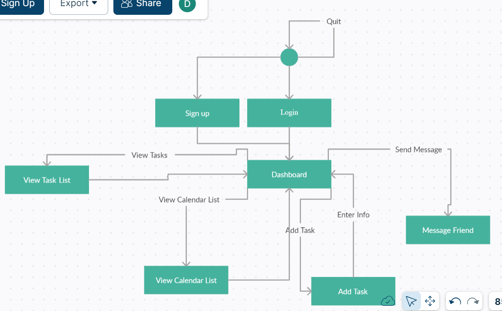

 
### Navigation Diagram

Description: The diagram represents each of the individual screens of the task planner and how the user will be able to navigate between each of the screens. At first, the user will be given the option to either log in, sign up, or quit. After logging in, the user will be sent to the Dashboard, where they will be shown their schedule and given the options of viewing a particular task, adding a new task, viewing their messages, switching over to a calendar view, or back to list view, which each option giving the user additional information and options. 

### Screen Layouts
 
 

Description: The user will be prompted with 2 options: logging in or signing up. 
- Login: The user will be asked to input their username and password. Once a valid username and password is given, the user will be sent to the dashboard screen.
- Sign Up: In the case that the user does not have an already existing account, the user can choose the "Sign Up" option, where they will be asked for their display name, username, and password to create a new account.
- Dashboard: After logging in, the user will be presented with their schedule, listing all of their tasks for the current week. In this current screen, the user has the option of changing their view to a calendar view, deleting an existing task, selecting and viewing a particular task, adding a new task, configuring their settings, viewing their friends page, and logging out.
- Settings: This is the settings page where the user will be given the options to change their display name, username, and password.
- New Task: After choosing the option of adding a task from the Dashboard, or choosing the option of editing a task after viewing it in the "View Task" screen, the user will be sent to a screen where they can add/change details onto a new (or already existing) task.
- View Task: After choosing the option to select and view a particular task in their schedule, they will be sent to a screen showcasing all the details of the task in question. These details will include the name of the task, a description, label, and deadline. The user will also have the option of deleting the task in question (which will send the user back to the dashboard interface).

## Class Diagram

## Description of class diagram

In the UML diagram depicted, there are 8 classes. Within the Person, Task, Label, TaskSorter, Importance Sorter, DateSorter, DBManager, and UserInterface classes, we have their respective private variables/public member functions. We also have the respective getter/setter functions that both receive inputs from the user and return their respective data members. Certain classes such as the Task class are dependent on the Label class and the TaskSorter interface is an abstract class that both the ImportanceSorter and DateSorter classes are derived from. The DBManager class controls the json file for loading and storing a Person object's account information, such as their username, email, password, list of tasks, list of friends, and messages. Additionally, there is a json file for loading and storing a list of Task objects and their individual names, descriptions, labels, deadline dates, and ratings. The UserInterface class controls all of the cin and cout statements to the user, how the user will be able to navigate through the different screens, and the format of each screen.
- Single Responsibility Principle (SRP): This SOLID principle is fulfilled by the Task and Label classes. The Task class could have additional attributes satisfy the requirements of a label, but this would violate the SRP. Instead, by creating another class 'Label' to fulfill this requirement, we end up with smaller classes that each focus on their individual attributes and functionality, leading to cleaner and more understandable code.
- Inferface Segregation Principle (ISP): This SOLID principle is fulfilled by the ImportanceSorter and DateSorter classes, which inherit from the TaskSorter interface. While, the TaskSorter class could have had different functions to sort Tasks based on different criteria, seperating them into different classes allows for easy readability and further expansion in the future.
 
 ## Screenshots

This is a screenshot of our tests passing. All other screenshots of the program have been displayed in the Screen Layouts portion of this README.
